<p align="center">✨Dvurechensky✨</p>

<h1 align="center"> Обработчик файлов инфокарт из игры 💤 Freelancer Rebirth 💤 </h1>

# ✨ Оглавление

- [✨ Оглавление](#-оглавление)
  - [Что делает❓](#что-делает)
    - [💥 Главное 💥](#-главное-)
    - [🌟 Порядок извлечения файлов из `dll` с помощью `Resource Hacker` 🌟](#-порядок-извлечения-файлов-из-dll-с-помощью-resource-hacker-)
    - [😈 Командная оболочка 😈](#-командная-оболочка-)

## Что делает❓

### 💥 Главное 💥

- Формирует выгрузку **`FLResources`** на `NET 3.5` совместимую с `Unity`
  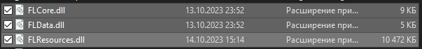 - Класс к которому обращаемся при подключении библиотеки к проекту - `ResControl` - Она имеет такое API для взаимодействия: - `Dictionary<string, int> LoadIds(int ids)` - подаём число из INI файла для ids_name или ids_info - получаем имя DLL файла и индекс строки с данными - `StatusHandle GetData(string nameResources, int id)` - подаём имя RESX файла запечатанного в DLL `(OfferBribeResources_name,NameResources_name,EquipResources_name,SBM3_name,SBM2_name,SBM_name,SBM_info,EquipResources_info,MiscTextInfo2_info,InfoCards_info,MiscText_info, SBM3_info)` и идентификатор - получаем значение ресурса по ключу из инициализированного RESX

- `FLGenerateLibrary` формирует файлы `.resx` для `FLResources` на основе данных полученных из `.dll` Win32 для игры `Freelancer 2003`. Данные предварительно получаем с помощью программы [`Resource Hacker`](Soft/reshacker_setup.exe). Порядок получения описан ниже
- `FLEDId` программа для быстрого конвертирования `ids_name` и `ids_info` в число которое зашито в `DLL` файл ресурсов игры `Freelancer Rebirth` (не завязан на freelancer.ini структуру) и наоборот покажет по имени dll и числу в нём тот номер который нужно вписать в `INI` файл

### 🌟 Порядок извлечения файлов из `dll` с помощью [`Resource Hacker`](Soft/reshacker_setup.exe) 🌟

1. Открываем `dll` в [`Resource Hacker`](Soft/reshacker_setup.exe) например `equipresources.dll`

   > выделяем `String Table` \
   > сохраняем .rc в папку `INPUT` которая лежит рядом с исполняемым `.exe` файлом \
   > меняем имя файла c `.rc` на `data.txt` \
   > внутри файла удаляем `LANGUAGE LANG_NEUTRAL, SUBLANG_NEUTRAL` \
   > 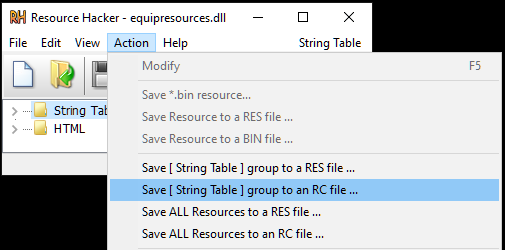 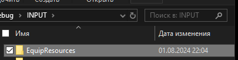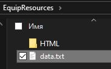 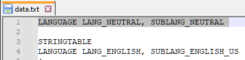

   > [!NOTE]
   > Поздравляю вы создали файл для определения `ids_name` полей!

2. В этом же `dll` если есть папка `HTML` нужно

   > выделяем `HTML` \
   > сохраняем .rc в папку `INPUT\HTML` которая лежит рядом с исполняемым `.exe` файлом \
   > удаляем файл `.rc` (нам нужны те `.txt` которые он там формирует под каждый `.html`) \
   > 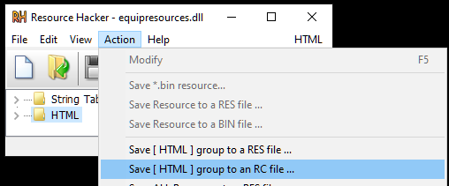 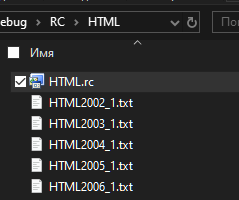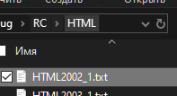

   > [!NOTE]
   > Поздравляю вы создали файл для определения `ids_info` полей!

3. Фактически мы получим папку `INPUT` обязательно в таком виде
   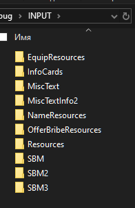

### 😈 Командная оболочка 😈

1. Команда `g [filename.ini] [field]` - поиск уникальных значений поля в INI файле который лежит в папке `Analis`

   - [filename.ini] - имя файла строго существующего в папке `Analis` (При желании туда можно положить свой INI)
   - [field] - Имя поля внутри файла которое там постоянно встречается но с одинаковым значением

   > Например

   ```sh
   g example.ini progres_field
   ```

   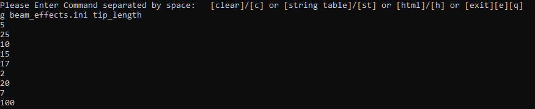
   

2. Команда `c [path/to/file.resx]` или `clear [path/to/file.resx]` - очистка всех данных ресурсов в `.resx` файле

   - [path/to/file.resx] - Как правило такой файл лежит в отдельном C# проекте и вы наполняете его информацией
     > Например

   ```sh
   c path/to/file.resx
   ```

   > или

   ```sh
   clear path/to/file.resx
   ```

3. Команда `st [path/to/file.resx] [path/to/data.txt]` - генерация из папки с TXT (.dll Win32 -> Resource Hacker -> .rc файл -> .txt файлы) строк в .resx файл

   - [path/to/file.resx] - Как правило такой файл лежит в отдельном C# проекте и вы наполняете его информацией
   - [path/to/data.txt] - Как правило это файл из папки `INPUT` конкретно отсканированной библиотеки `dll` - файл `data.txt`

   > Например

   ```sh
   st path/to/file.resx path/to/data.txt
   ```

4. Команда `st [path/to/file.resx] [path/to/html]` - генерация из папки с TXT (.dll Win32 -> Resource Hacker -> .rc файл -> .txt файлы) строк в .resx файл

   - [path/to/file.resx] - Как правило такой файл лежит в отдельном C# проекте и вы наполняете его информацией
   - [path/to/html] - Как правило это папка HTML с информациннными картами (которые указываются в `ids_info`) из папки `INPUT`

   > Например

   ```sh
   st path/to/file.resx path/to/html
   ```

5. Команда `import` или `i` - копирует тестовые данные в папку `INPUT` для того чтобы можно было генерировать `.resx` файл ресурсов

   > Например

   ```sh
   import
   ```

   > или

   ```
   i
   ```

6. Команда `all` или `a` - генерирует из папки `INPUT` файлы ресурсов в папку `OUTPUT` (их также можно перезаписывать командами описанными выше)

   > Например

   ```sh
   all
   ```

   > или

   ```
   a
   ```

7. Команда `rhtml` - вывод текста сгенерированного в папке `HTML` после обработки в формате для `Unity - TextMeshPro`

   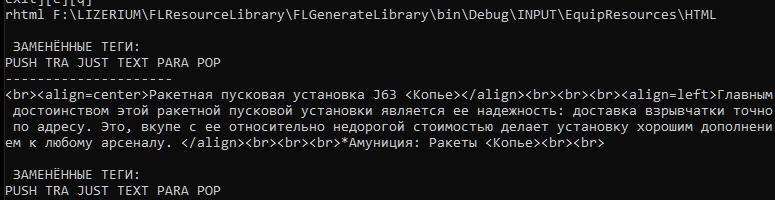

8. Команда `exit` или `e` или `q` - выход

9. Команда начинающаяся на `::text` выводит найденные совпадения слов которые встречаются в зашитых данных в `FLResources.dll`
   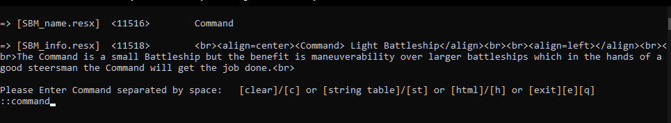

10. Команда начинающаяся на `::489` выводит найденные совпадения идентификаторов которые встречаются в зашитых данных в `FLResources.dll`
    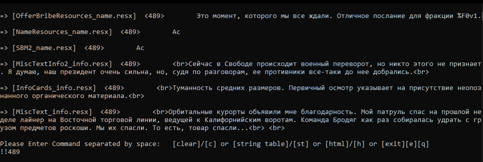

<p align="center">✨Dvurechensky✨</p>
